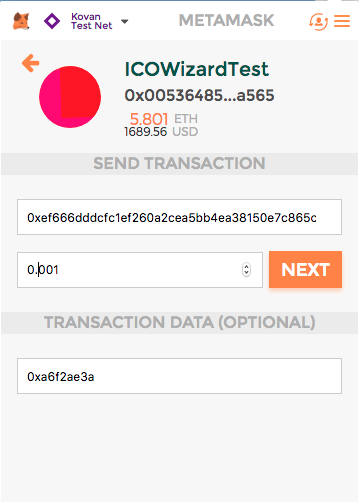

# ICO Wizard DApp

[](https://raw.githubusercontent.com/hyperium/hyper/master/LICENSE)
[](https://travis-ci.org/oraclesorg/ico-wizard)

_Attention_!

Please, read instruction before you'll start to create crowdsales using ICO Wizard. Consider to deploy on the Mainnet _after_ testing on Kovan testnet.   

- [ICO Wizard DApp](#ico-wizard-dapp)
  * [Introduction](#introduction)
  * [Demo](#demo)
  * [Requirements](#requirements)
  * [Strategy](#strategy)
  * [How to run](#how-to-run)
    + [Run local version for development](#run-local-version-for-development)
    + [ICO configuration](#ico-configuration)
    + [Tests](#tests)
    + [Investment with transaction from MetaMask](#investment-with-transaction-from-metamask)
  * [Deploying of crowdsale to Mainnet](#deploying-of-crowdsale-to-mainnet)
    + [Time](#time)
    + [Price](#price)
  * [How to verify ICO Wizard contracts in Etherscan](#how-to-verify-ico-wizard-contracts-in-etherscan)
    + [Crowdsale contract verification:](#crowdsale-contract-verification)
  * [Projects built on ICO Wizard](#projects-built-on-ico-wizard)
  * [Contributors guide](#contributors-guide)
  * [Support](#support)
  * [Notable Contributors](#notable-contributors)
  * [Disclaimer](#disclaimer)


## Introduction

A quote: `ICO tools should be available for non-coders for free. Raising funds from a crowd is our basic human right.`

ICO wizard is a tool to create token and crowdsale contracts in five simple steps.  Wizard is based on  [TokenMarket](https://github.com/TokenMarketNet/ico) contracts. Wizard is baked how we like it: decentralized, client side, serverless, open source, free, awesome.

ICOs usually have two or more contracts. One token contract and one or more crowdsale contract plus supplemental contracts, e.g., safe math, pricing strategy, etc. Most token contracts are the same (ERC-20); most crowdsale contracts are different.  Token implementation should be stable for compatibility, and it is crucial to connect token to exchanges and wallets. Crowdsale contracts on another side should follow fashion and differentiate a project from others, e.g., create a new type of [FOMO](http://www.urbandictionary.com/define.php?term=fomo), fear of missing out.


## Demo

You can try it on [https://wizard.oracles.org](https://wizard.oracles.org) or watch a demo

[](https://www.youtube.com/watch?v=Hvs1gICcXGU)

## Requirements

- Google Chrome, Chromium, or Google Chrome Canary
- [Metamask](https://chrome.google.com/webstore/detail/metamask/nkbihfbeogaeaoehlefnkodbefgpgknn). Ethereum web wallet for Google Chrome. Must have to publish contracts to the network.
- Kovan testnet coins.
    -  Create an account in Metamask, copy it's address and ask for free coins on [Kovan's gitter](https://gitter.im/kovan-testnet/faucet)
- Parity for manual operations, e.g., adding people to whitelist after creation of crowdsales, finalizing, etc.
    -  [How to install Parity](https://github.com/paritytech/parity/wiki/Setup)
    - Sync it. `parity --chain kovan --warp ui`
    - Export private key from Metamask and import in to Parity in UI.
- Patience. Metamask doesn't support bulk transactions. Simplest crowdsale will ask you to sign ~10 transactions. 
## Strategy

At the moment, the Wizard supports one type of crowdsale contract, the mighty "whitelisted with tiers and cap". This strategy is popular in modern ICOs due to regulatory involvement in the process (September 2017). A native approach to comply with regulation is to perform KYC of buyers and restrict participants from democratic countries, e.g., the U.S. or PRC. 

Features of "Whitelisted with tiers and cap" strategy:
- Tiers. A crowdsale can have one or more tiers. Each tier has a set of configurable parameters:
    -  Wallet address. Collected funds will be sent to the wallet address immediately after receiving from a participant of the crowdsale.
    -  Start time. A time when a tier of crowdsale will start. You can't set up time in the past. 
    -  End time. A time when a tier of crowdsale will end.
    -  Rate. Exchange rate for a token to the ether. E.g., exchange rate 100 means that for one ether you can buy 100 tokens.
    -  Supply. The maximum amount of tokens available to buy in a tier. Max cap of the crowdsale equals to the sum of all supply of all tiers.
    -  Allow modifying. Controversial feature aka "Box of Pandora". It allows owners to modify Start time, End time, Rate, and Supply after the crowdsale. 
- Whitelist. A crowdsale can have one or more whitelisted addresses. If there are no whitelisted addresses than nobody can buy tokens on that tier. Whitelists are inherited. E.g., if a user was on Tier 1 and didn't buy max cap on Tier 1, he can buy on Tier 2, and other tiers.  Can be updated after the creation of the crowdsale using parity client. Each whitelist has a set of configurable parameters:
    -  Address. Whitelisted ethereum address.
    -  Min. The minimum amount of tokens to buy.
    -  Max. The maximum amount of tokens to buy. 

## How to run

Open [https://wizard.oracles.org](https://wizard.oracles.org) and follow steps.

### Run local version for development

For dev purposes you can build and run ICO Wizard on your machine.

```
git clone https://github.com/oraclesorg/ico-wizard.git wiz
cd wiz
git submodule update --init --recursive --remote
npm install
npm start
```

Go to [localhost:3000](http://localhost:3000) and look around the app!

### ICO configuration
If you are the owner of ICO instance, you can add parameters of created ICO to config (`./src/components/Common/config.js`) for [security reasons](https://github.com/oraclesorg/ico-wizard/issues/133).
Demo config is commented in the file itself.
```
const networks = {
    mainnet: 1,
    morden: 2,
    ropsten: 3,
    rinkeby: 4,
    kovan: 42,
    oraclesTest: 12648430
}

/*
DEMO CONFIG:
export const ICOConfig = { 
    crowdsaleContractURL: '0xc5a21a3e32d9d614ed46e4b2352670fcb21009ee',
    networkID: networks.kovan
};
*/

export const ICOConfig = { 
    
};
```

### Tests

ICO wizard contracts tests are written in javascript with [Truffle framework](http://truffleframework.com/). 
Contracts are deploying in [testrpc](https://github.com/ethereumjs/testrpc) with the script.
Test scripts are added to Travis CI and executed at every pull request.

If you want to start it by yourself, simply run the command `npm test` from the root directory. 
It will start testrpc at port 8545, Truffle will compile, deploy contracts to it and Truffle will execute tests. 

*Note:* Kill testrpc after tests will executed: 
```
sudo kill `sudo lsof -t -i:8545`.
```

Currently available tests cover the following scenario:

The updatable, whitelisted one tier crowdsale contract with one address in white list and reserved tokens for the same address (both: in absolute values and in percentage)

Checklist of contracts' testing:

```
Contract: CrowdsaleTokenExt
    ✓ should get absolute reserved tokens for investor (48ms)
    ✓ should get reserved tokens in percentage for investor (50ms)
    ✓ should get mint agent: crowdsale contract
    ✓ should get mint agent: NullFinalizeAgentExt contract
    ✓ should get mint agent: ReservedTokensFinalizeAgent contract
    ✓ should get release agent (57ms)
    ✓ should get owner
  Contract: FlatPricingExt
    ✓ should get last crowdsale tier for pricing strategy contract
    ✓ should return rate of pricing strategy contract
  Contract: MintedTokenCappedCrowdsaleExt
    ✓ should get last crowdsale tier for crowdsale contract
    ✓ should get finalize agent
    ✓ should get early participant white list (42ms)
    ✓ should get early participant white list minCap (77ms)
    ✓ should get early participant white list maxCap (55ms)
    ✓ shouldn't accept investment from not whitelisted user (117ms)
    ✓ shouldn't accept investment from whitelisted user less than minCap (122ms)
    ✓ shouldn't accept investment from whitelisted user more than maxCap (117ms)
    ✓ should accept buy from whitelisted user within cap range (185ms)
    ✓ should return updated balance of multisig (108ms)
    ✓ should return token's balance we have bought in previous step
    ✓ should accept buy less than minCap at second buy (221ms)
    ✓ should return updated balance of multisig (105ms)
    ✓ should accept buy of fractionated amount of tokens from whitelisted user within cap range (178ms)
    ✓ should return token balance we have bought in previous step
    ✓ should return updated balance of multisig (104ms)
    ✓ shouldn't accept investment from whitelisted user that exceeds maxCap (111ms)
    ✓ should set endsAt for crowdsale (46ms)
    ✓ should get state for crowdsale (139ms)
    ✓ should finalize crowdsale (346ms)
    ✓ should return updated token balance of user include reserved tokens
  Contract: NullFinalizeAgentExt
    ✓ 
  Contract: ReservedTokensFinalizeAgent
    ✓ 
  Contract: SafeMathLibExt
    ✓ should accurately multiply numbers
    ✓ should accurately divide numbers
    ✓ should accurately subtract numbers
    ✓ should accurately add numbers
  36 passing (4s)
```

### Investment with transaction from MetaMask

1. Open MetaMask Chrome plugin

2. Connect to the network, where the crowdsale contract is deployed. For example `mainnet`.

3. Choose an account with sufficient balance at this network.

4. Send transaction to the address of the crowdsale contract with the data `0xa6f2ae3a`. Value to send is in ETH. For example, if you put 0.01 to input, you will invest 0.01 ETH.



## Deploying of crowdsale to Mainnet


### Time

The one-tier crowdsale contract takes ~24 minutes in total.

Estimates for each contracts:


SafeMathLib : 02:00

Token: 04:15

Pricing strategy: 01:32

Crowdsale: 04:52

Finalize agent: 01:52


Estimates for each methods invocation:


setLastCrowdsale for Pricing Strategy: 00:58

updateJoinedCrowdsales: 02:00

setMintAgent: 01:30

setMintAgent: 02:10

setFinalizeAgent: 01:20

setReleaseAgent: 00:53

transferOwnership: 00:40

### Price

Attention!

Deploying to the Mainnet is expensive. For a contract with one tier the price is 0.16 ETH.

With the price of 1 ETH of $300.0 USD the price of one deployment will be $48.0 USD.


## How to verify ICO Wizard contracts in Etherscan

**Important!:** All information required for verification of ICO Wizard contracts located in a text file. You must download it on the Step 4 of ICO Wizard. There is **no** way to get it later and you'll need to repeat wizard for the new set of conracts to get the file.

### Crowdsale contract verification:

1. Open Etherscan verification link. For example, for the Kovan chain: [https://kovan.etherscan.io/verifyContract](https://kovan.etherscan.io/verifyContract).
2. Fill the form inputs with the data from the file. The mapping is the following:

   2.1. **Contract address** is *Crowdsale contract address for [Tier name]*.

   2.2. **Contract Name** is *Crowdsale contract name*. Default value: `MintedTokenCappedCrowdsaleExt`

   2.3. **Compiler** is *Compiler Version*. Default value is 0.4.11. You should choose a value with `commit` message inside. For example, *Compiler Version* value will be: `v0.4.11+commit.68ef5810`

   2.4. **Optimization** is *Is optimization enabled?*. Default value: `true`

   2.5. **Enter the Solidity Contract Code below** is *Crowdsale contract source*

   2.6. **Constructor Arguments ABI-encoded (For contracts that accept constructor parameters)** is *Crowdsale contract ABI encoded constructor arguments for [Tier name]*

3. For **Contract Library Address (For contracts that use libraries, supports up to 5 libraries)** By default we use only one library.

**Library_1 Name** type `:` and then the value of *SafeMathlLib library name* header from the file. Default value: `:SafeMathLibExt`.

**Library Contract Address:** is the value of *SafeMathlLib library address* header from the file. For example: `0xe9ae538ffea453eae179e45a787ca76db619d40d`.

4. Then click **Verify and publish** button.

You can verify other contracts:
- `SafeMathLibExt`. Unique. The example of verified [SafeMathLibExt is here](https://kovan.etherscan.io/address/0x58cfad3f53a86ebeaab117a5436aaf948d4be3cb#code).
- `MintedTokenCappedCrowdsaleExt`. The crowdsale contract for a tier. One crowdsale may have multiple tiers. By default there is one tier. The example of verified [MintedTokenCappedCrowdsaleExt is here](https://kovan.etherscan.io/address/0x1c1e2efd273210ba642b07db36580d4b45550968#code).
- `CrowdsaleTokenExt`. The token contract. Unique. The example of verified [CrowdsaleTokenExt is here](https://kovan.etherscan.io/address/0xd791d3bcafb29014b37956105315f15e2481b331#code).
- `FlatPricingExt`. The pricing strategy contract. Each tier has one pricing strategy contract. The example of verified [FlatPricingExt is here](https://kovan.etherscan.io/address/0x47832db4fc8b296acec4b5bc008b42797b9bf702#code).
- `NullFinalizeAgentExt`. The finalize agent contract for every tier that is not the last. If you have n tiers, there will be n-1 `NullFinalizeAgentExt` contract. Thus, it is used only with multiple tiers crowdsale. The example of verified [NullFinalizeAgentExt is here](https://kovan.etherscan.io/address/0x4706E44874361A3288E2233e8FB4b30369cC3e4b#code).
- `ReservedTokensFinalizeAgent`. The finalize agent contract of the last tier. Unique. Only last finalize agent is used to finalize the crowdsale for all tiers. The example of verified [ReservedTokensFinalizeAgent is here](https://kovan.etherscan.io/address/0x032b4c44f1729eb0ccc673682463e3f4763aaade#code).

Therefore, for a simple crowdsale contract with one tier you should verify 5 contracts. For a crowdsale with n-tiers you should verify 3n+2 contracts on Etherscan. 

You can find values to verify each contract in the downloaded file. For steps **2.1**, **2.2**, **2.5**, **2.6** values will be different. Other values are the same for the same crowdsale.

## Projects built on ICO Wizard

None! Send PR if you are the first.
We created ICO Wizard for a crowdsale of [Oracles Network](https://oracles.org/).

## Contributors guide

Issues which are looking for a handsome contributors are marked as _LookingForContributor_ label in [Issues](https://github.com/oraclesorg/ico-wizard/issues?q=is%3Aissue+is%3Aopen+label%3ALookingForContributor)  section of the GitHub 

## Support 

You can get support on [Telegram](https://t.me/oraclesnetwork).

## Notable Contributors

Brought to you by [Oracles Network](https://oracles.org/team) team.

We appreciate contributors from the community:

- Jeff Christian
- Roman Storm

## Disclaimer

The software is in Beta stage. 
ICO Wizard is constantly under active development. The “Beta” labelling implies that while the core features of the software have been implemented, bugs and issues may still remain undiscovered until this phase of testing is complete. As such, ICO Wizard may experience the following issues, but not limited to, during usage:

- lost of tokens/funds from incorrect configuration;
- unexpected delays;
- unexpected visual artifacts.